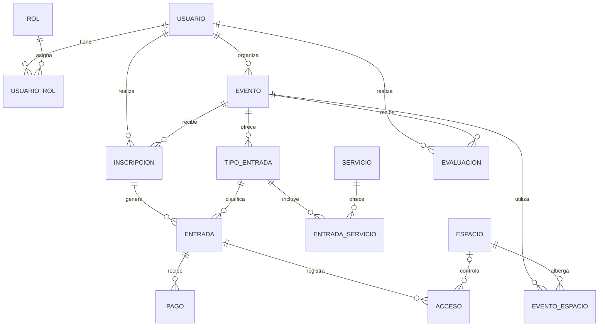

# Modelo relacional

## Plataforma de Gestión de Eventos y Conferencias

### Información del proyecto

- **Autor:** Andrés Sebastián Pinzón Gutiérrez
- **Código:** 2221887
- **Universidad:** Universidad Industrial de Santander
- **Materia:** Base de Datos I

## Nivel de normalización

Tercera forma normal (3FN); las relaciones cumplen además BCNF según las dependencias funcionales mencionadas en el [informe de normalización](./Informe-normalizacion.md).

En este documento presenta el modelo relacional. Se organiza usuarios, roles, eventos, espacios, inscripciones, entradas, pagos, servicios, accesos y evaluaciones. Las claves primarias identifican cada fila; las claves foráneas mantienen la integridad referencial; las reglas de unicidad, obligatoriedad y rango delimitan los valores admitidos.

## Relaciones y dominios

Los dominios en este proyecto expresan los tipos de dato y sus longitudes o precisiones.

`BIGINT IDENTITY` representa un entero largo autogenerado.
`BIGINT`, un entero largo.
`INTEGER`, un entero.
`SMALLINT`, un entero pequeño.
`VARCHAR(n)`, texto de hasta `n` caracteres.
`TEXT`, texto sin longitud fija.
`NUMERIC(p,s)`, un número decimal de `p` dígitos totales y `s` decimales.
`DATE`, una fecha.
`TIMESTAMPTZ`, fecha y hora con zona horaria.

`PK` es clave primaria, `FK` clave foránea y `UK` una clave única. Salvo las columnas indicadas como opcionales, los atributos son obligatorios. Las reglas de valores permitidos aparecen en la columna «Clave / regla».

### USUARIO

| Columna | Dominio | Clave / regla |
| --- | --- | --- |
| id_usuario | BIGINT IDENTITY | PK |
| nombres | VARCHAR(100) | Obligatorio |
| apellidos | VARCHAR(100) | Obligatorio |
| correo | VARCHAR(254) | UK; se almacena en minúscula |
| documento | VARCHAR(30) | UK |
| telefono | VARCHAR(30) | Opcional |
| estado | VARCHAR(15) | `activo`, `inactivo` o `bloqueado` |
| fecha_registro | TIMESTAMPTZ | Obligatorio; valor predeterminado actual |

### ROL

| Columna | Dominio | Clave / regla |
| --- | --- | --- |
| id_rol | BIGINT IDENTITY | PK |
| nombre | VARCHAR(50) | UK |
| descripcion | TEXT | Opcional |

### USUARIO_ROL

| Columna | Dominio | Clave / regla |
| --- | --- | --- |
| id_usuario | BIGINT | PK, FK → USUARIO |
| id_rol | BIGINT | PK, FK → ROL |
| fecha_asignacion | TIMESTAMPTZ | Obligatorio; valor predeterminado actual |

### EVENTO

| Columna | Dominio | Clave / regla |
| --- | --- | --- |
| id_evento | BIGINT IDENTITY | PK |
| nombre | VARCHAR(150) | Obligatorio |
| descripcion | TEXT | Opcional |
| tipo_evento | VARCHAR(50) | Obligatorio |
| modalidad | VARCHAR(12) | `presencial`, `virtual` o `hibrida` |
| fecha_inicio | TIMESTAMPTZ | Obligatorio; menor o igual a fecha_fin |
| fecha_fin | TIMESTAMPTZ | Obligatorio |
| estado | VARCHAR(15) | `borrador`, `publicado`, `cancelado` o `finalizado` |
| capacidad_maxima | INTEGER | Obligatorio; mayor que cero |
| id_organizador | BIGINT | FK → USUARIO |

### ESPACIO

| Columna | Dominio | Clave / regla |
| --- | --- | --- |
| id_espacio | BIGINT IDENTITY | PK |
| nombre | VARCHAR(120) | Obligatorio |
| ubicacion | VARCHAR(200) | Obligatorio |
| capacidad | INTEGER | Obligatorio; mayor que cero |
| tipo_espacio | VARCHAR(50) | Obligatorio |
| estado | VARCHAR(15) | `activo`, `inactivo` o `mantenimiento` |

### EVENTO_ESPACIO

| Columna | Dominio | Clave / regla |
| --- | --- | --- |
| id_evento | BIGINT | PK, FK → EVENTO |
| id_espacio | BIGINT | PK, FK → ESPACIO |
| fecha_asignacion | TIMESTAMPTZ | Obligatorio; valor predeterminado actual |

La clave primaria compuesta evita asignar dos veces el mismo espacio al mismo evento. Las reservas de un mismo espacio en eventos con horarios superpuestos deben impedirse mediante una política de reserva/validación adicional si se requiere controlar disponibilidad temporal.

### INSCRIPCION

| Columna | Dominio | Clave / regla |
| --- | --- | --- |
| id_inscripcion | BIGINT IDENTITY | PK |
| id_usuario | BIGINT | FK → USUARIO |
| id_evento | BIGINT | FK → EVENTO |
| fecha_inscripcion | TIMESTAMPTZ | Obligatorio; valor predeterminado actual |
| estado | VARCHAR(15) | `activa`, `cancelada` o `pendiente` |

La pareja `(id_usuario, id_evento)` es única para evitar inscripciones duplicadas.

### TIPO_ENTRADA

| Columna | Dominio | Clave / regla |
| --- | --- | --- |
| id_tipo_entrada | BIGINT IDENTITY | PK |
| id_evento | BIGINT | FK → EVENTO |
| nombre | VARCHAR(80) | Obligatorio; único dentro del evento |
| descripcion | TEXT | Opcional |
| precio | NUMERIC(12,2) | Obligatorio; mayor o igual a cero |
| cupo_total | INTEGER | Obligatorio; mayor o igual a cero |
| fecha_inicio_venta | TIMESTAMPTZ | Obligatorio |
| fecha_fin_venta | TIMESTAMPTZ | Obligatorio; mayor o igual a fecha_inicio_venta |
| estado | VARCHAR(15) | `activo`, `inactivo` o `agotado` |

La disponibilidad actual se calcula a partir del cupo y las entradas emitidas; no se guarda como una segunda cifra que pueda quedar desactualizada.

### ENTRADA

| Columna | Dominio | Clave / regla |
| --- | --- | --- |
| id_entrada | BIGINT IDENTITY | PK |
| id_inscripcion | BIGINT | FK → INSCRIPCION |
| id_tipo_entrada | BIGINT | FK → TIPO_ENTRADA |
| codigo_acceso | VARCHAR(100) | UK |
| fecha_emision | TIMESTAMPTZ | Obligatorio; valor predeterminado actual |
| estado | VARCHAR(15) | `activa`, `cancelada` o `bloqueada` |

Una entrada solo puede emitirse cuando el tipo de entrada pertenece al mismo evento de la inscripción. Esta regla de integridad entre relaciones debe comprobarse al registrar o modificar la entrada y al cambiar el evento de la inscripción o del tipo de entrada.

### SERVICIO

| Columna | Dominio | Clave / regla |
| --- | --- | --- |
| id_servicio | BIGINT IDENTITY | PK |
| nombre | VARCHAR(100) | UK |
| descripcion | TEXT | Opcional |
| estado | VARCHAR(15) | `activo` o `inactivo` |

### ENTRADA_SERVICIO

| Columna | Dominio | Clave / regla |
| --- | --- | --- |
| id_tipo_entrada | BIGINT | PK, FK → TIPO_ENTRADA |
| id_servicio | BIGINT | PK, FK → SERVICIO |
| condiciones | TEXT | Opcional |

La relación representa los servicios que incluye cada tipo de entrada y resuelve la relación muchos a muchos.

### PAGO

| Columna | Dominio | Clave / regla |
| --- | --- | --- |
| id_pago | BIGINT IDENTITY | PK |
| id_entrada | BIGINT | FK → ENTRADA |
| valor | NUMERIC(12,2) | Obligatorio; mayor que cero |
| medio_pago | VARCHAR(20) | `efectivo`, `tarjeta`, `transferencia`, `plataforma` u `otro` |
| estado | VARCHAR(15) | `pendiente`, `aprobado`, `rechazado` o `reembolsado` |
| referencia | VARCHAR(100) | UK |
| fecha_pago | TIMESTAMPTZ | Obligatorio; valor predeterminado actual |

Se registra el valor de cada transacción para preservar su importe histórico. No se guardan números ni códigos de seguridad de tarjetas.

### ACCESO

| Columna | Dominio | Clave / regla |
| --- | --- | --- |
| id_acceso | BIGINT IDENTITY | PK |
| id_entrada | BIGINT | FK → ENTRADA |
| id_espacio | BIGINT | FK → ESPACIO; opcional para acceso virtual |
| fecha_hora | TIMESTAMPTZ | Obligatorio; valor predeterminado actual |
| resultado | VARCHAR(15) | `aprobado`, `rechazado` o `repetido` |
| punto_control | VARCHAR(100) | Opcional |

Si se indica un espacio, debe estar asignado al evento de la entrada y no se debe retirar esa asignación mientras existan accesos que la referencien. Cada entrada admite como máximo un acceso aprobado; los intentos rechazados o repetidos sí se conservan.

### EVALUACION

| Columna | Dominio | Clave / regla |
| --- | --- | --- |
| id_evaluacion | BIGINT IDENTITY | PK |
| id_usuario | BIGINT | FK → USUARIO |
| id_evento | BIGINT | FK → EVENTO |
| calificacion | SMALLINT | Obligatorio; entero entre 1 y 5 |
| comentario | TEXT | Opcional |
| fecha_evaluacion | TIMESTAMPTZ | Obligatorio; valor predeterminado actual |

La pareja `(id_usuario, id_evento)` es única: cada usuario registra como máximo una evaluación por evento.

## Relaciones entre tablas

Se utiliza aquí mermaid para mostrar las relaciones entre tablas:

## Reglas de integridad y operación

1. La fecha inicial del evento no puede ser posterior a su fecha final.
2. Un evento debe tener capacidad positiva; la capacidad disponible de una tarifa no puede ser negativa.
3. La inscripción de un usuario a un evento no se puede duplicar; tampoco su evaluación del mismo evento.
4. El tipo de entrada asociado con una entrada debe pertenecer al evento de la inscripción que la originó; los cambios posteriores no pueden dejar referencias incompatibles.
5. Si un acceso especifica un espacio, este debe estar asignado al evento de la entrada; la asignación no puede retirarse mientras haya accesos relacionados.
6. Una entrada puede tener como máximo un acceso `aprobado`; la base de datos lo asegura con un índice único parcial. Los intentos rechazados o repetidos se conservan.
7. Solo los pagos con estado `aprobado` cuentan como ingresos. Los estados y los valores quedan sujetos a sus restricciones `CHECK`.
8. La aplicación debe comprobar que el total vendido no supere `cupo_total` y que el aforo no exceda los espacios asignados. Estas reglas necesitan una transacción con bloqueo o control de concurrencia para evitar sobreventa.
9. Se pueden consultar las entradas emitidas, asistencia e ingresos mediante consultas; no se almacenan como contadores redundantes.
