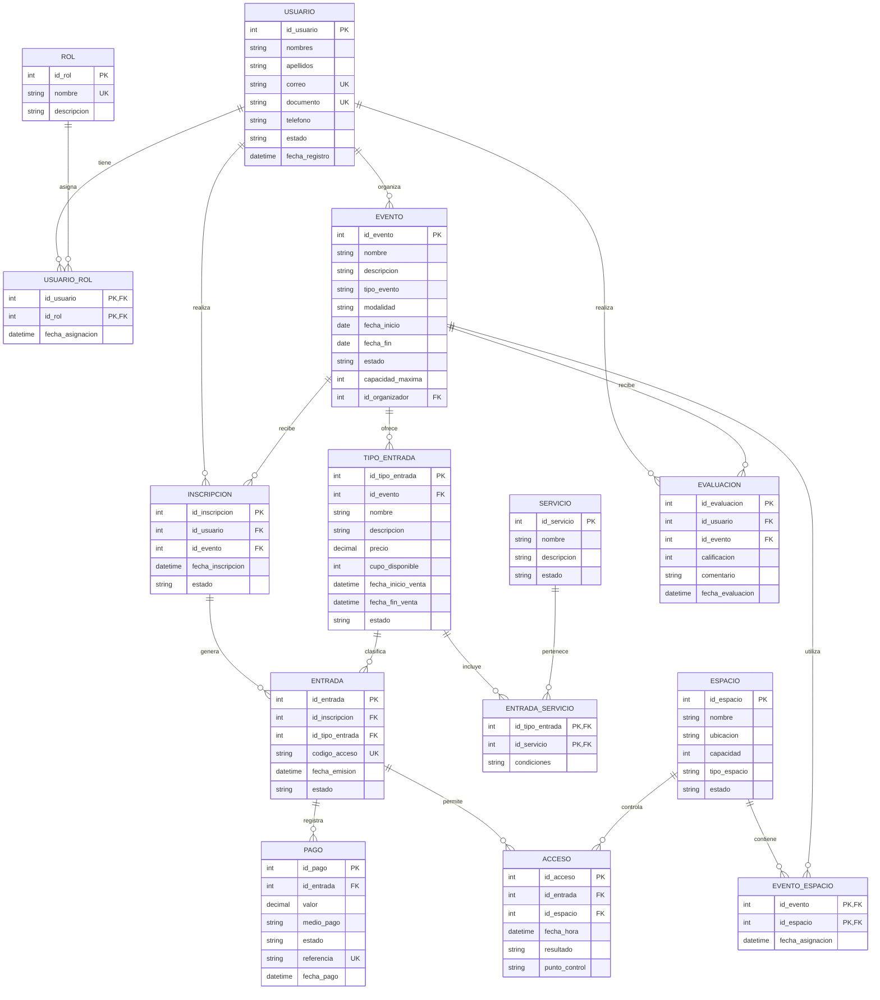

# Modelo gráfico entidad-relación

## Plataforma de Gestión de Eventos y Conferencias

### Información del proyecto

- **Autor:** Andrés Sebastián Pinzón Gutiérrez
- **Código:** 2221887
- **Universidad:** Universidad Industrial de Santander
- **Materia:** Base de Datos I

Este archivo contiene únicamente la representación gráfica del primer modelo entidad-relación.

> En GitHub, el bloque anterior se visualiza como un diagrama gráfico cuando se abre este archivo.
