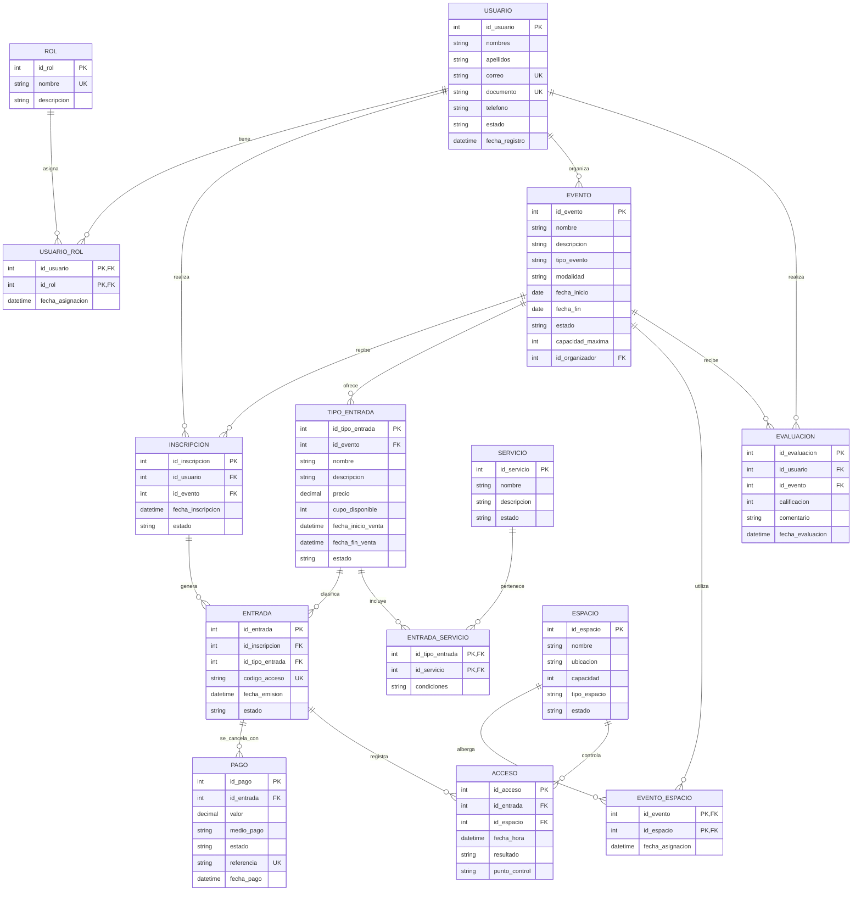

# Primer modelo entidad-relación

## Plataforma de Gestión de Eventos y Conferencias

### Información del proyecto

- **Autor:** Andrés Sebastián Pinzón Gutiérrez
- **Código:** 2221887
- **Universidad:** Universidad Industrial de Santander
- **Materia:** Base de Datos I

### Propósito

Este es el primer modelo entidad-relación de la plataforma. Muestra, de forma inicial, cómo se relacionan los usuarios, los eventos, las entradas, los pagos, los ingresos y las evaluaciones.

El modelo es inicial y se puede ampliar después. En otra versión se podrían agregar sesiones, agenda, conferencistas, patrocinadores, facturación, modalidad virtual y notificaciones.

## Diagrama entidad-relación

## Descripción de las entidades

| Entidad | Responsabilidad |
| --- | --- |
| `USUARIO` | Almacena las personas que utilizan la plataforma. |
| `ROL` | Define permisos o perfiles, como asistente, organizador y administrador. |
| `USUARIO_ROL` | Une a los usuarios con los roles que tienen. |
| `EVENTO` | Contiene la información general del evento o conferencia y su organizador. |
| `ESPACIO` | Registra salones, auditorios u otros lugares disponibles. |
| `EVENTO_ESPACIO` | Relaciona los eventos con uno o varios espacios. |
| `INSCRIPCION` | Relaciona a una persona con un evento y registra su estado. |
| `TIPO_ENTRADA` | Define una tarifa, cupo y periodo de venta para un evento. |
| `ENTRADA` | Representa el acceso individual y su código de validación. |
| `SERVICIO` | Catálogo de beneficios ofrecidos por la plataforma. |
| `ENTRADA_SERVICIO` | Indica qué servicios incluye cada tipo de entrada. Es necesaria porque una entrada puede tener varios servicios. |
| `PAGO` | Registra las transacciones y su estado. |
| `ACCESO` | Guarda cada intento de ingreso y permite calcular asistencia y aforo. |
| `EVALUACION` | Guarda la calificación y comentarios de un asistente sobre un evento. |

## Reglas de negocio iniciales

1. No deben existir dos usuarios con el mismo correo o documento.
2. Un usuario puede tener uno o varios roles, según sus responsabilidades.
3. La fecha de inicio de un evento debe ser anterior o igual a la fecha de finalización.
4. Un evento puede usar uno o varios espacios. Un espacio no debería estar reservado para dos eventos al mismo tiempo.
5. Cada inscripción pertenece a un usuario y a un evento.
6. Cada tipo de entrada pertenece a un evento y guarda el precio que tenía cuando se ofreció.
7. El `codigo_acceso` de cada entrada debe ser diferente.
8. Una entrada puede tener varios registros de pago, pero solo los pagos aprobados se deben contar como ingresos.
9. Cada acceso debe indicar si fue aprobado, rechazado o repetido.
10. La cantidad de personas esperada no debe superar la capacidad de los espacios asignados.
11. La calificación de una evaluación debe estar dentro de una escala, por ejemplo, de 1 a 5.
12. Los accesos aprobados permiten saber cuántas personas asistieron y comparar ese número con la capacidad del espacio.

## Posibles ampliaciones

- `SESION` y `CONFERENCISTA` para administrar la agenda detallada.
- `EVENTO_SESION` o una relación equivalente para asignar sesiones a eventos.
- `NOTIFICACION` para recordatorios y confirmaciones.
- `CUPON` o `DESCUENTO` para campañas de venta.
- `CERTIFICADO` para emitir constancias de participación.
- Integración con pasarelas de pago y plataformas de videoconferencia.
